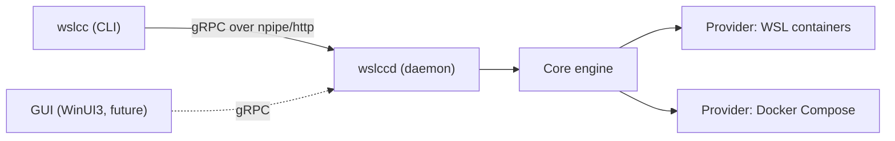

# WSLCC — WSL Containers Compose

`wslcc` brings a `docker compose`-style workflow to Microsoft's [WSL containers](https://learn.microsoft.com/en-us/windows/wsl/wsl-container) feature. It fills the gap of a missing `compose` command in `wslc`, and it can also drive Docker Compose so you have a single, unified interface across both backends — locally or (later) on a remote machine.

> Status: early scaffold / public-preview era tooling. WSL containers themselves are in public preview (2026); install with `wsl --update --pre-release`. Expect rough edges and breaking changes.

## Components

- `wslcc` — the command-line tool. Mirrors `docker compose ...` under a `compose` branch (`wslcc compose up`, `wslcc compose ps`, ...), plus `wslcc daemon ...` and `wslcc version`.
- `wslccd` — a small background daemon exposing a gRPC service (named pipe locally; optional HTTP for remote). Runs as a per-user process or a Windows Service.
- A provider-agnostic core library, plus providers for **WSL containers** (`wslc`) and **Docker Compose** (`docker`).



## Quick start

Prerequisites: Windows with WSL pre-release (`wsl --update --pre-release`), the .NET 10 SDK, and optionally Docker (for the docker provider).

```powershell
# Build
dotnet build Wslcc.slnx

# Run the vertical slice
wslcc daemon start
wslcc version
wslcc compose version
wslcc daemon stop
```

`wslcc` talks to `wslccd` over a named pipe by default (`npipe://wslccd`). Use `--host` to change transport:

```powershell
wslcc --? ; # help
wslcc version -H npipe://wslccd          # local named pipe (default)
wslcc version -H http://remote-host:5211 # remote daemon over HTTP/2 (no auth yet)
wslcc version --provider docker          # target a specific provider
```

## Repository layout

- `src/` — C# source (libraries, providers, daemon, CLI).
- `tests/` — unit tests.
- `docs/` — architecture, provider notes, CLI mapping, daemon, compose file support, roadmap, and the TODO list.
- `examples/` — sample compose projects.

See [docs/architecture.md](docs/architecture.md) for the full picture and [docs/todo.md](docs/todo.md) for what's next (including a planned managed API NuGet package and a WinUI3 GUI).

## License

MIT — see [LICENSE](LICENSE).
