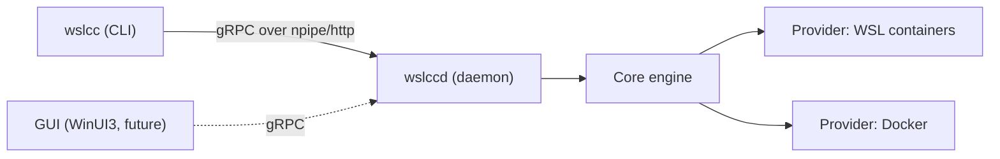

# WSLCC — WSL Containers Compose

`wslcc` brings a `docker compose`-style workflow to Microsoft's [WSL containers](https://learn.microsoft.com/en-us/windows/wsl/wsl-container) feature. It fills the gap of a missing `compose` command in `wslc`, and it can also drive the Docker CLI so you have a single, unified interface across both backends — locally or (with an optional unauthenticated HTTP endpoint) on a remote machine.

> Status: early public-preview era tooling. WSL containers themselves are in public preview (2026); install with `wsl --update --pre-release`. Expect rough edges and breaking changes. Not production-ready.

## Install

**Prerequisites:** Windows x64 with WSL pre-release (`wsl --update --pre-release`). Optionally Docker, for the `docker` provider.

There is **no tagged release yet** (packaging and winget manifests exist for when one is cut — see [docs/roadmap.md](docs/roadmap.md) milestone 0.2). Until then, build from source with the .NET 10 SDK:

```powershell
dotnet build Wslcc.slnx
.\src\out\wslcc.exe daemon start
```

See [CONTRIBUTING.md](CONTRIBUTING.md). After a release exists: `winget install AdrianoRepetti.WSLCC`, or download the `win-x64` zip from [GitHub Releases](https://github.com/arepetti/wslcc/releases) (self-contained — no SDK required to *run*).

Before removing an installed build, unregister autostart if you used it: `wslcc daemon uninstall` (then `wslcc daemon stop` if a daemon is still running).

## Components

- `wslcc` — the command-line tool. Mirrors `docker compose ...` under a `compose` branch (`wslcc compose up`, `wslcc compose ps`, ...), plus `wslcc daemon ...` and `wslcc version`.
- `wslccd` — a small background daemon exposing a gRPC service (named pipe locally; optional HTTP for remote). Runs as a per-user process, on demand or started automatically at logon.
- A provider-agnostic core library, plus providers for **WSL containers** (`wslc`) and **Docker** (`docker`).



## Quick start

Bring up the sample stack (options go **after** the leaf command):

```powershell
wslcc daemon start
wslcc compose up --project-directory examples/web-redis -d
wslcc compose ps --project-directory examples/web-redis
wslcc compose down --project-directory examples/web-redis
```

If a command says the daemon is not reachable, see [docs/troubleshooting.md](docs/troubleshooting.md) — an elevated shell often cannot talk to a non-elevated daemon (and vice versa).

`wslcc` talks to `wslccd` over a named pipe by default (`npipe://wslccd`). Use `-H`/`--host` to change transport (the `compose` commands use `--wslcc-host`/`--wslcc-provider` so they don't clash with standard `docker compose` options):

```powershell
wslcc --help                                   # help
wslcc version -H npipe://wslccd                # local named pipe (default)
wslcc version -H http://remote-host:5211       # remote daemon over HTTP/2 (no auth yet)
wslcc compose version --wslcc-provider docker  # target a specific provider
```

## Repository layout

- `src/` — C# source (libraries, providers, daemon, CLI).
- `tests/` — unit tests.
- `docs/` — see [docs/README.md](docs/README.md) for the index (architecture, CLI/daemon/compose references, [compatibility](docs/compatibility.md), [troubleshooting](docs/troubleshooting.md), roadmap).
- `examples/` — sample compose projects (start with [examples/web-redis](examples/web-redis)).

Coming from `docker compose`? Start with [docs/compatibility.md](docs/compatibility.md). See [docs/architecture.md](docs/architecture.md) for the full picture and [docs/todo.md](docs/todo.md) for what's next (including a planned managed API NuGet package and a WinUI3 GUI). Contributors building from source need the .NET 10 SDK — see [CONTRIBUTING.md](CONTRIBUTING.md).

## License

MIT — see [LICENSE](LICENSE).
