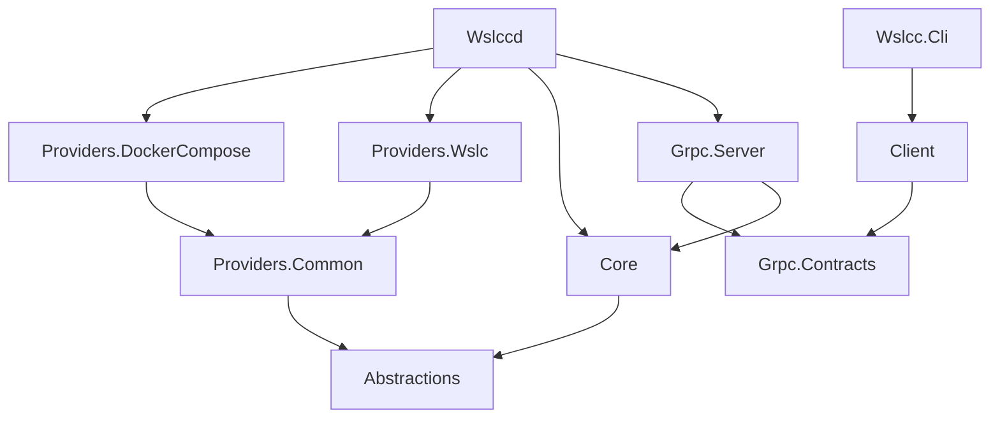
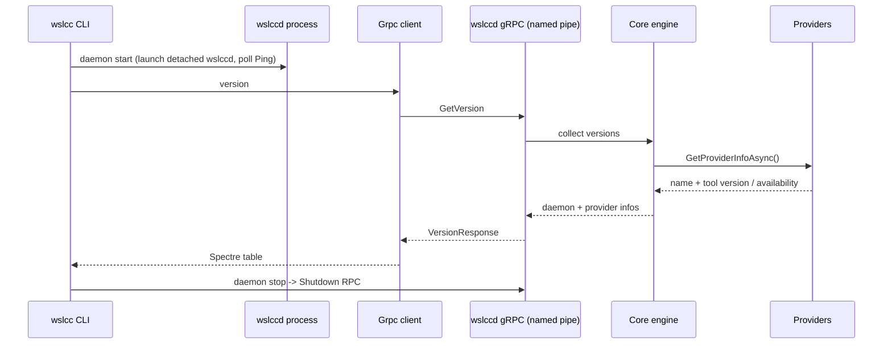

# Architecture

WSLCC is split into small libraries with a clear dependency direction, two executables (the CLI and
the daemon), and pluggable providers.

## Projects

| Project | TFM | Role |
| --- | --- | --- |
| `Wslcc.Abstractions` | netstandard2.0 | Contracts and models: `IContainerProvider`, `IComposeEngine`, `ProviderInfo`, Compose model types, `ProcessRunner`. |
| `Wslcc.Core` | netstandard2.0 | Provider-agnostic logic: Compose YAML parser and the orchestration engine (`ComposeEngine`). |
| `Wslcc.Providers.Common` | net10.0 | Shared base (`CliContainerProviderBase`, `CliCommandBuilder`) for providers that drive a standard container CLI. |
| `Wslcc.Providers.Wslc` | net10.0 | Provider for WSL containers. Container ops from the shared CLI base (`wslc`); version/availability via the SDK path (`Microsoft.WSL.Containers`) gated behind `WSLC_SDK`, with a `wslc.exe` fallback. |
| `Wslcc.Providers.DockerCompose` | net10.0 | Provider that drives the `docker` CLI (container ops) and `docker compose version` (version). |
| `Wslcc.Grpc.Contracts` | netstandard2.0 | `.proto` definitions and generated gRPC types shared by server and clients. |
| `Wslcc.Grpc.Server` | net10.0 | gRPC service implementation calling the core engine. |
| `Wslcc.Client` | net10.0 | Typed gRPC client + transport selection (named pipe / HTTP). Shared by the CLI and future GUI. |
| `Wslccd` | net10.0 (exe) | The daemon: Kestrel + gRPC, Windows Service support, composition root. |
| `Wslcc.Cli` | net10.0 (exe) | The `wslcc` command-line tool (Spectre.Console.Cli). |

## Dependency direction

Providers depend only on `Abstractions`. The daemon is the composition root: it registers the
providers and constructs the `ComposeEngine`, keeping `Core` provider-agnostic.

## Runtime flow (version slice)

`Ping` is a fast readiness RPC that does not touch providers (used by `daemon start`/`status`), while
`GetVersion` resolves each provider's underlying tool version and may shell out to `docker`/`wslc`.

## Transport

The daemon hosts gRPC over HTTP/2. Locally it listens on a Windows named pipe via Kestrel's
`ListenNamedPipe`; the client connects with a `SocketsHttpHandler.ConnectCallback` backed by
`NamedPipeClientStream`. A remote HTTP/2 endpoint can be enabled for cross-machine use (no auth yet).
See [daemon.md](daemon.md).
